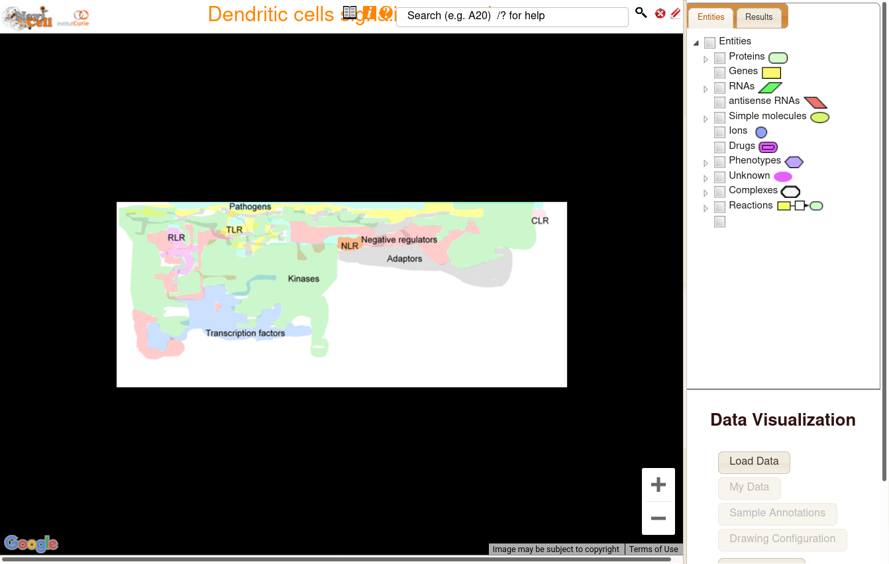
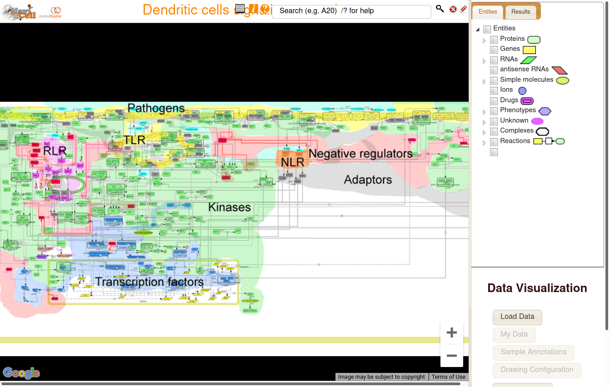
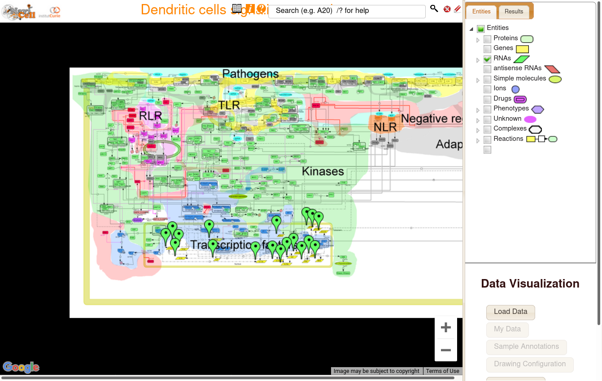
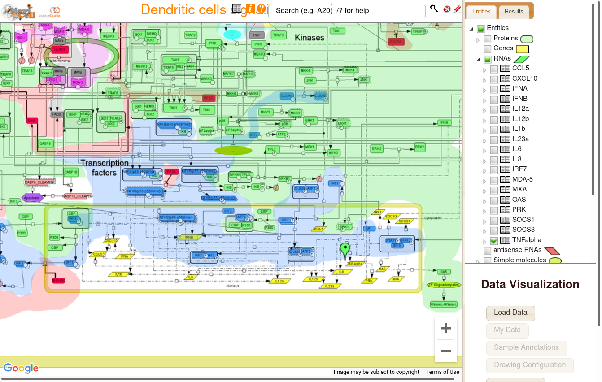

# Browsing maps on NaviCell 3.0 web server

#### Opening the map

To browse a NaviCell map, click on the View Map button ().

In this case, we choose the Dendritic cells signalling network. After clicking, the page of the map loads.

#### Browsing the map

You can now see various colors representing various groups belonging to the Dendritic cells signalling network, such as Transcription factors, or Kinases.

By using **Ctrl + Scroll**, you are able to zoom in/out on the map. 

Here when zooming in, more details appear (meaning that this maps uses semantic zooming). You start to see edges and nodes corresponding to the interaction network of the signalling pathway. 

On the right-side menu, you can select the nodes by type : Proteins, Genes, RNAs, etc. In this case we selected RNAs, which become highlighted on the map.

In this menu you can also select individual nodes by expanding it's type. In this case, we expanded RNAs, and selected TNF-alpha.
