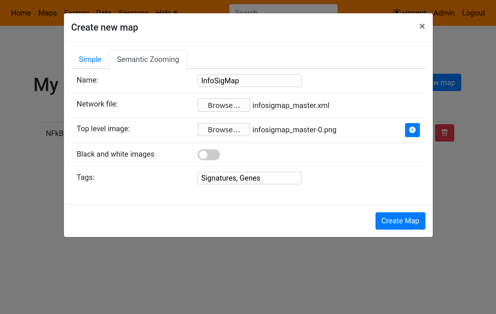
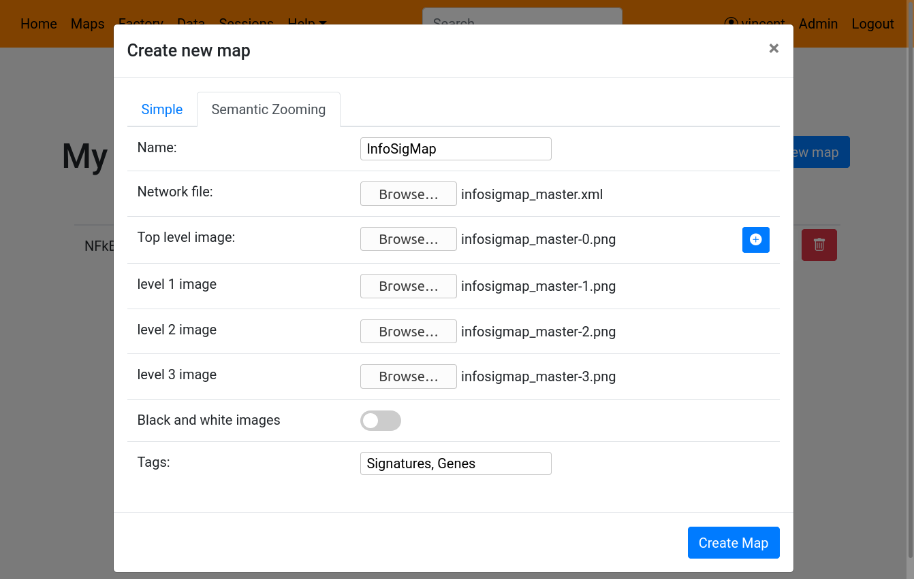
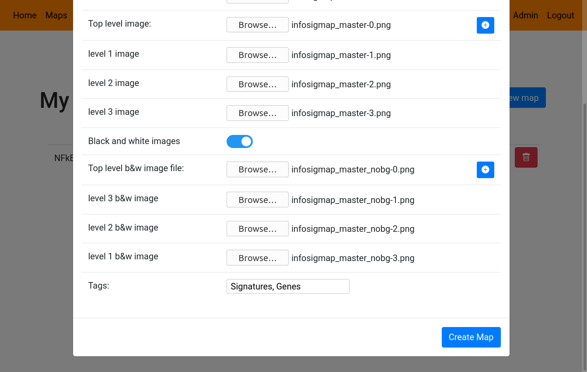

# Building maps with semantic zooming on NaviCell 3.0 web server

To build maps, click on the **Factory** tab in the top bar. This will open the NaviCell Factory page. 

Note that you need a NaviCell 3.0 Web Server account, and you must be logged in in order to create maps (and see this Factory link).

#### Creating the map

To create a map, click on the **Create new map** button on the top right. This will open a new dialog window where you can select the **Semantic Zooming** tab. 

You will then have to choose a name for your new map, and select a **Cell Designer** file for the map. Next you will have to select your base image (lowest zoom level).

)

To add lower levels of your map (higher zoom level), click on the *+* button on the right of the top level image. Each click will add one level, for which you will have to select an image. 

)

You also have the option to inform images specifically built for being used when plotting data on top of the map. Usually these maps are only black and white, to avoid mixing colors. Once activated, this option will ask you for as many image as your have for the colored images.

Once finished, click on the **Create Map** button. This will close the dialog and show you your new map already on the list, with a loader icon. Once your map created, the loader will dissapear and show the links to open the map, as well as a checkbox to publish it to NaviCell Web Server. 

Please note that map creation can be a very long task, going up to several hours for the biggest maps !

