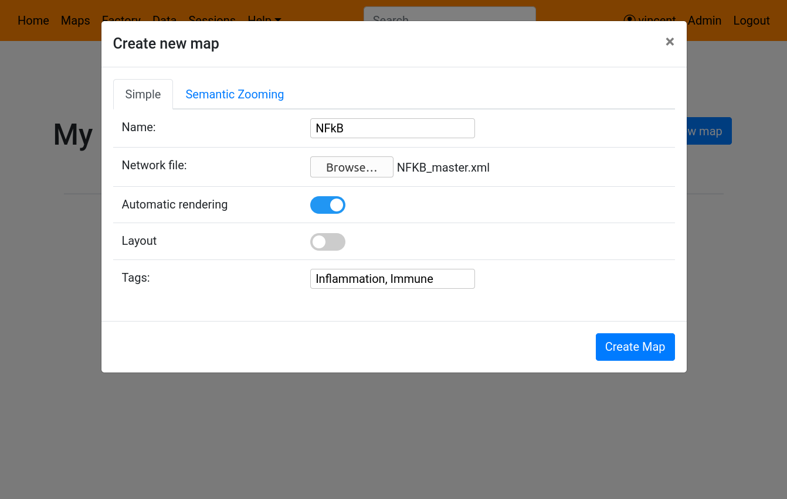

# Building simple maps on NaviCell 3.0 web server

To build maps, click on the **Factory** tab in the top bar. This will open the NaviCell Factory page. 

Note that you need a NaviCell 3.0 Web Server account, and you must be logged in in order to create maps (and see this Factory link).

#### Creating the map

To create a map, click on the **Create new map** button on the top right. This will open a new dialog window where you will have to input the name of the newly created map, and select a **CellDesigner** file of the map. 

By default, NaviCell Web Server can generate the image of the map using automatic rendering by **Newt**. For maps without layout, an automatic layout is also available. 

Finally, in order to make your map more accessible once published on the server, you will have to choose tags to describe your map. You can use as many tags as you want, separated by a comma. 

You also have the option of providing an already renderer image of your CellDesigner file, by inactivating the automatic rendering. This will show a new file input to choose the image file.

Once finished, click on the **Create Map** button. This will close the dialog and show you your new map already on the list, with a loader icon. 

Once your map created, the loader will dissapear and show the links to open the map, as well as a checkbox to publish it to NaviCell Web Server. 

Please note that map creation can be a very long task, going up to several hours for the biggest maps !

#### Publishing the map

Once created, you can publish your map to make it accessible via the Collection of Maps of NaviCell Web Server. 

To publish it, just click on the slider, which will turn it blue. Your map is published !

