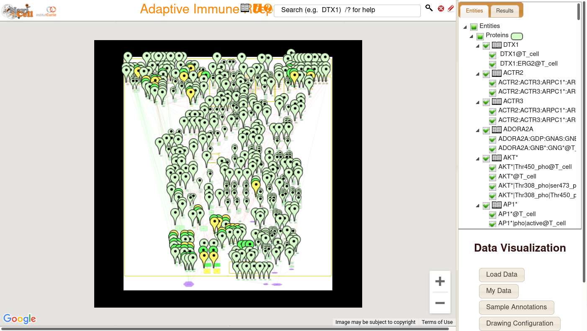
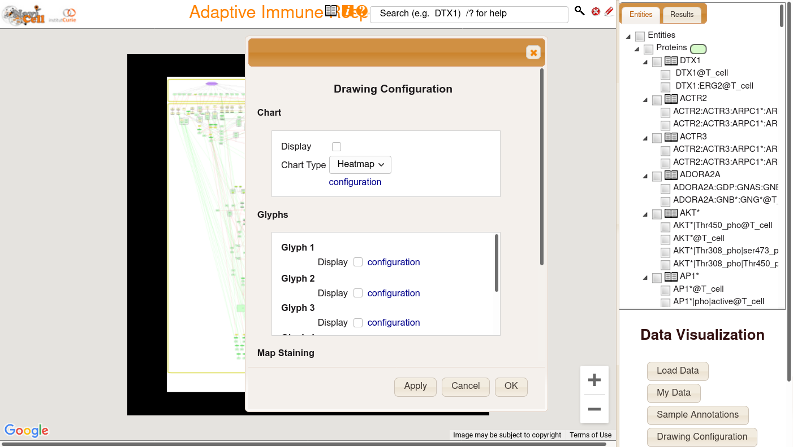
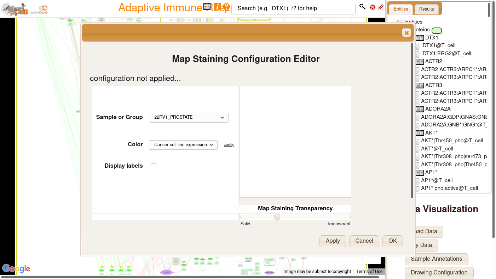
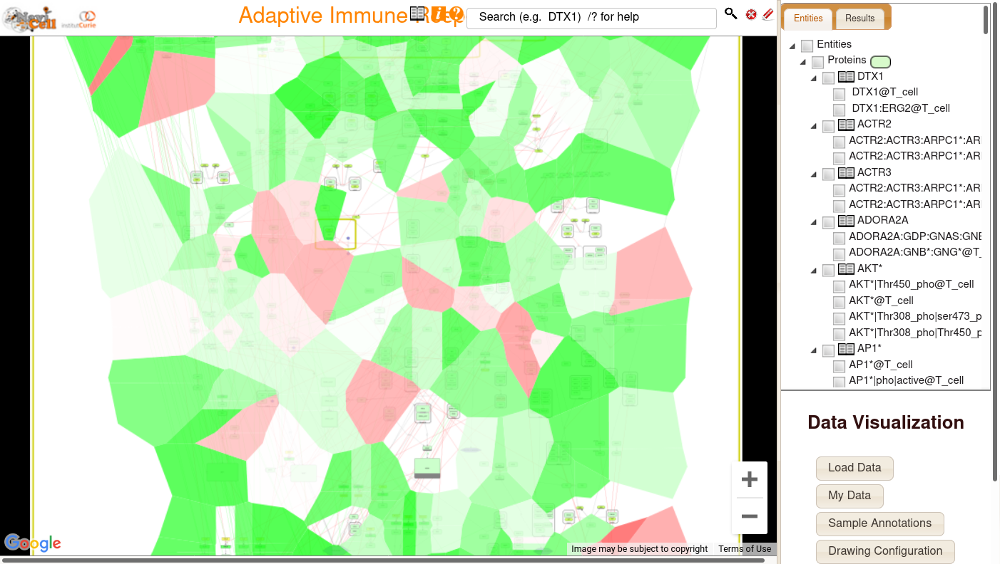
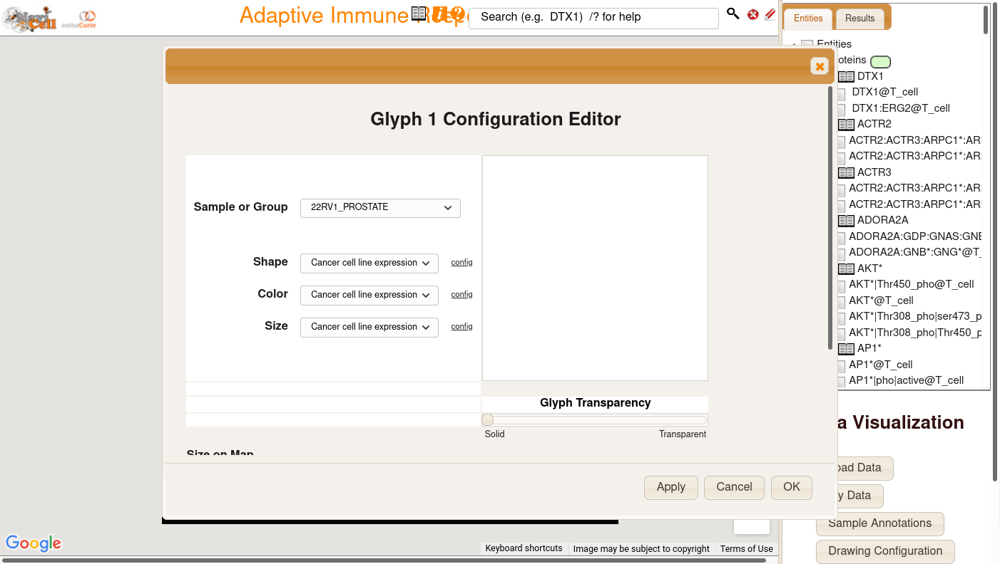
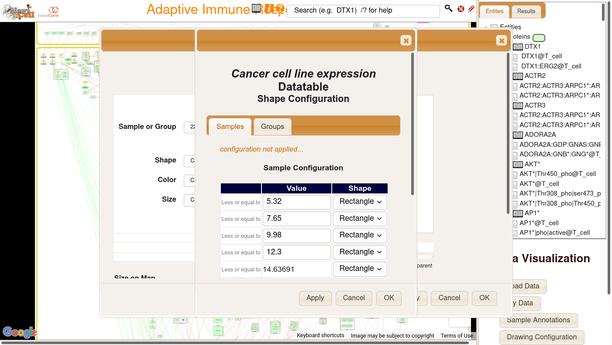
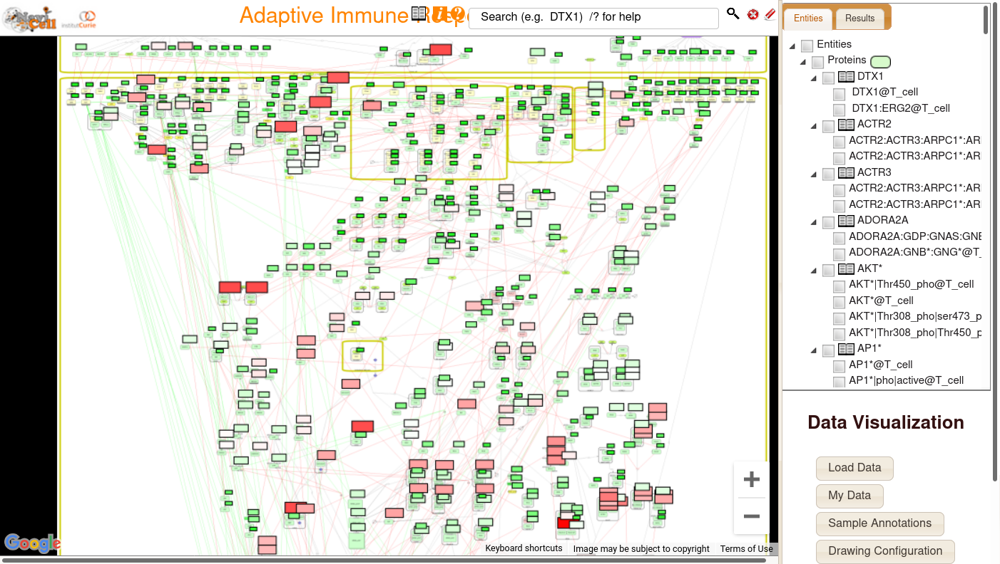

# Plotting data on top of NaviCell maps

One important functionality of NaviCell is the possibility to visualize data on top on a map. This allows to easily see active or inactive parts of pathways. 

Once the data is loaded on your map, the nodes for which data is associated will be highlighted.

To start plotting data, click on the **Drawing configuration** on the bottom right menu. This will the drawing configuration dialog.

Different methods are available to plot data on top of the maps.
#### Staining

Map Staining will divise the space of the maps into parts which correspond to a specific node on the map. If will then color these parts according to the value of the data. 

To start staining, click on the configuration of the map staining.
This will open the configuration editor, where you will be asked to choose a sample or group present in the dataset, as well as the data to check for the coloring. By clicking on the color configuration, you get access to easily configuration coloring schemes.

You can also choose the transparency level of the coloring, to hide or let visible the map behind the coloring.

Once these settings chosen, you can validate your choices and close the configuration. The staining will appear over the map.

#### Glyphs

Another way of plotting data on top of maps is to draw a small glyph just next to nodes. 

To draw such glyphs, click on the configuration of the first glyph, which will open the configuration editor.

Again, you need to choose the sample or group in your dataset that you want to plot. Then, you have to decide the shape, the color, and the size of your glyphs. Each one of them is parametrable depending on the value of data. First you need to select your dataset for any of these properties. 

If you prefer that your shape does not vary according to data, open the config next to the shape. This will open a new window where you can define ranges corresponding to each shape. In our case, since we don't want the shape to vary, we choose to have every value represented as a rectangle. 

Once validated your choices, you will see glyphs appearing for every node which has data associated. In this case, the large rectangles means that the node is under/over expressed, with color indicating if it's under or over expressed.

