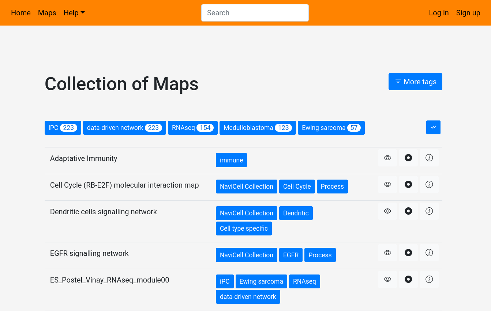

# Public Maps on NaviCell 3.0 web server

#### Accessing public maps

NaviCell 3.0 web servers offers to browse public maps, wherever you are identified or not. These maps are available on the **Maps** tab. 

Once on the **Maps** page, you can visualize the Collection of Maps and start browing it, or start a NaviCell session.

#### Filtering by tags

These maps have tags attached, to allow to filter them using these tags. You can already see on the top the 5 most used tags. You can activate or deactivate all by clicking in the right most button, or individually by clicking on the tags 

By clicking on the **More tags** button, you will show all of the existing tags, and you will be able to filter the maps using any tag. To hide the list, click again on **More tags**

