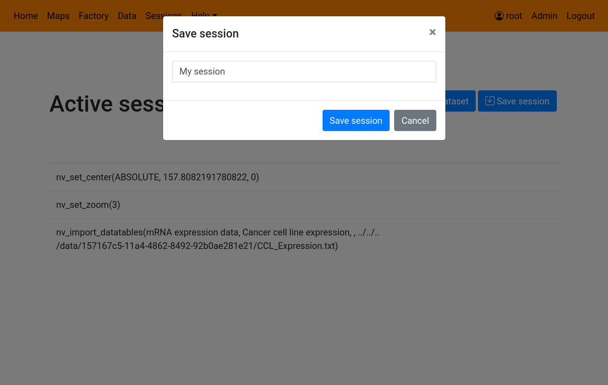
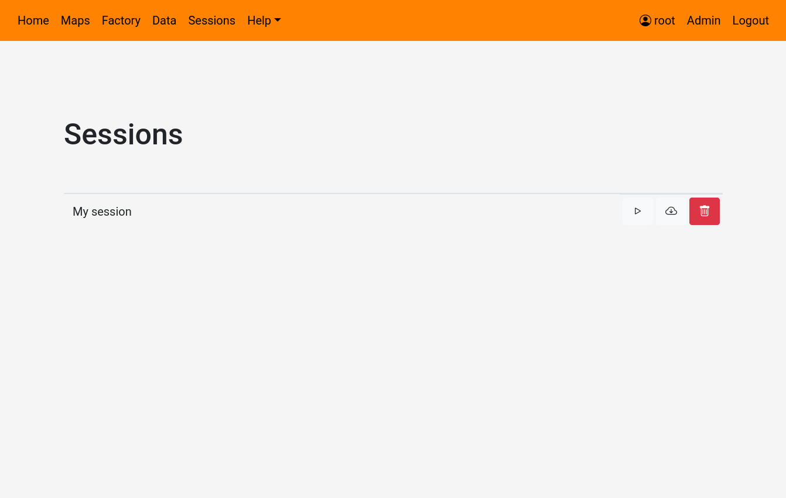

# Saving/Resuming a browsing session on NaviCell 3.0 web server

#### Saving session

For connected users, session can be saved in order to be resumed later or exported.

To do so, click on the **Save Session** button on the top right of the active session page.

This will open a new dialog, where you will have to choose a name for this session. Once save, this session will be accessible in the **Sessions** page. 

#### Resuming a session

To resume a previously saved session, go to the sessions page using the **Session** tab. 

To resume a session, simply click on the **Resume session** button ().

This will load the active session page, and open a new window with the NaviCell map. The active session page will show a loading indicator until all the previously performed actions are replayed on the NaviCell map.
