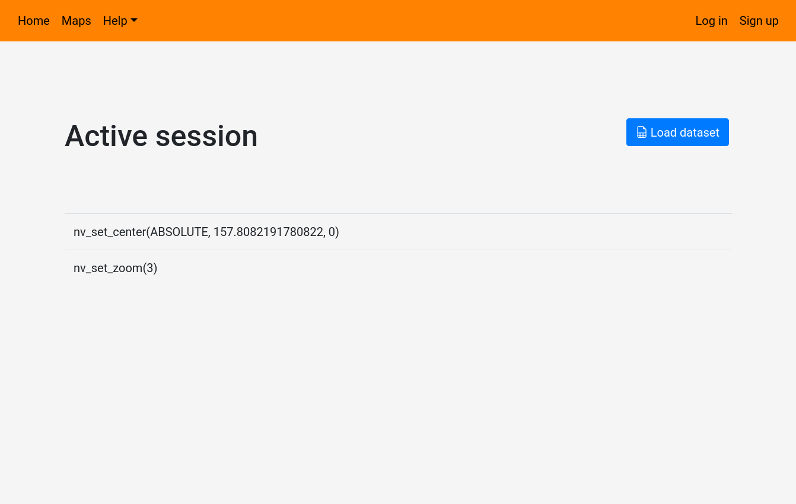

# Launching a NaviCell session on NaviCell 3.0 web server

NaviCell sessions allows you to browse maps, and load datasets available on NaviCell Web Server to be used in the map. 
For connected users, it also allows to save your actions in NaviCell Web Server, and thus resume sessions. 

#### Starting a session
To start a NaviCell session, click on the Start Session button ().

This will load the active session page, and open a new window on your browser with the desired map. 

Be careful with popup blockers, as some will prevent NaviCell to open a new window. If a notification appears, or if the windows doesn't open, look into authorizing popups for NaviCell.

The active session page will show you in real time the actions performed on NaviCell map on the other window. Here it shows the initial positioning and zoom performed when loading the NaviCell map.

#### Loading datasets

On this page you have the option to load a dataset into your session, in order to make it available to your map. To do so, click on the **Load dataset** button. 
NaviCell will open a dialog with a dropdown menu containing accessible datasets. You also have the option of selecting a remote dataset in the **Remote** tab. Once the dataset selected, click on the **Load data** button.

Note that for larger maps, the loading of the dataset will take several minutes. Once loaded into the map, the dialog will close, and the command history will show that the data has been imported.

On the NaviCell Map window, we can see that the button **My Data** on the bottom right has been activated, showing that data has indeed been loaded

