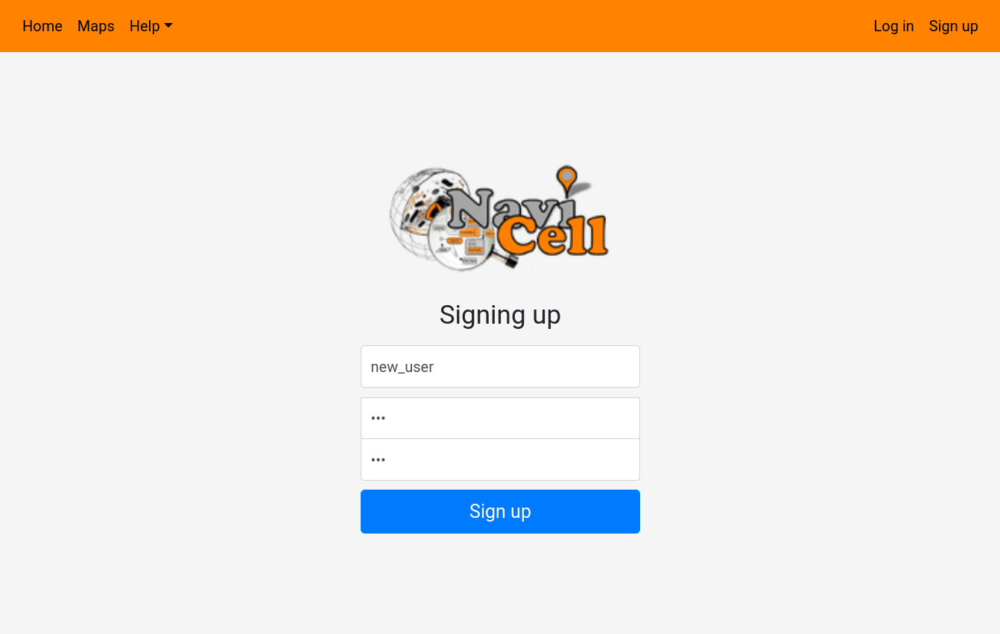
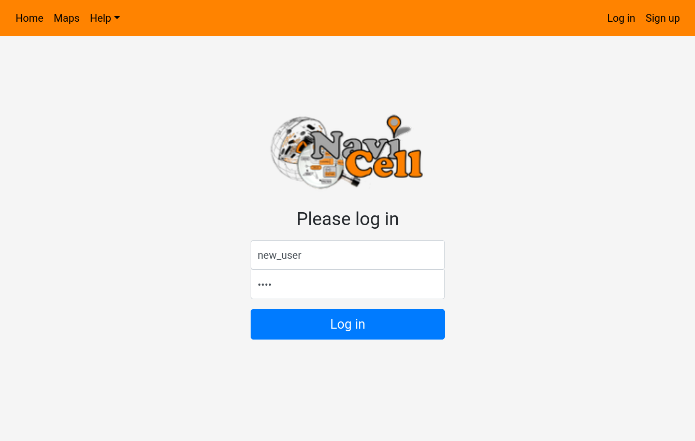

# User accounts

User accounts allows you to perform various actions not accessible to anonymous users. First of all, it allows you to create maps, and make them public on the NaviCell 3.0 Web Server. It also allows you to upload datasets to be used in the NaviCell sessions. Finally, it allows you to save NaviCell sessions. 

#### Registering

To register go to the **Sign Up** link on the top bar. This will open up the registration page. 

Choose a username, and a password, and click on the **Sign up** button. This will create your account, though you won't be able to use it yet as it needs to be activated by an administrator. 

#### Logging in

To register go to the **Log in** link on the top bar. This will open up the logging page. 

Indicate a username, and a password, and click on the **Log in** button. 